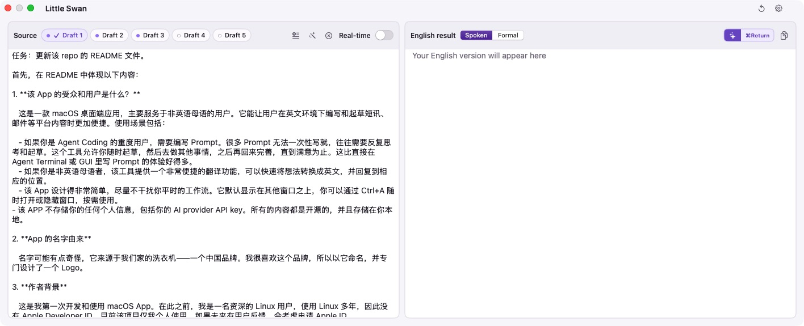
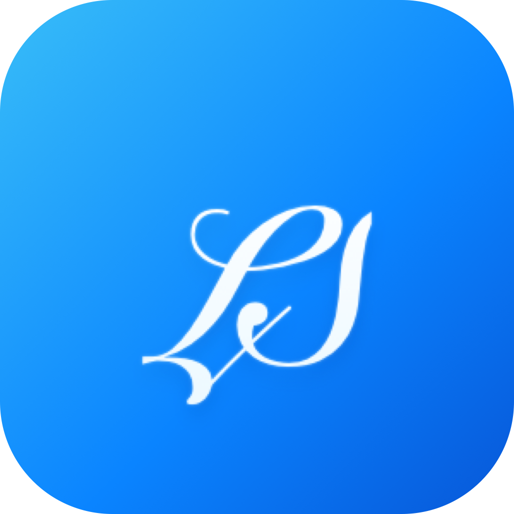

# Little Swan

Little Swan is a native macOS writing companion for non-native English speakers. It gives you a lightweight place to draft prompts, messages, emails, and other short-form writing, then turns text from any language into natural English when you are ready.

It supports DeepSeek, OpenAI, and OpenRouter as bring-your-own-key writing engines. DeepSeek is the default provider.

Requires macOS 14 Sonoma or later.

## A quiet workspace for English writing

<table>
  <tr>
    <td width="78%" align="center">
      
    </td>
    <td width="22%" align="center">
      
    </td>
  </tr>
  <tr>
    <td align="center"><sub>Main writing window</sub></td>
    <td align="center"><sub>Little Swan logo</sub></td>
  </tr>
</table>

Little Swan is designed for people who regularly work in English but do not want the drafting process to interrupt the rest of their workflow.

- **For agent coding and prompt drafting:** complex prompts rarely arrive fully formed. Keep several drafts in Little Swan, switch to another task, and return later to refine them instead of composing everything inside an agent terminal or chat window.
- **For non-native English speakers:** write an idea in the language that comes naturally, generate an English version, edit it, and copy it back to the app where you need it.
- **For focused, low-friction work:** the compact panel stays above other windows by default. Press **Control-A** from anywhere to open or hide it whenever you need it.
- **For local-first use:** Little Swan has no account system, analytics, or Little Swan backend. Drafts, preferences, and provider API keys are kept on your Mac. Text is sent only to the AI provider you select when you request generation. The source is publicly available in this repository for inspection; see [Copyright and permissions](#copyright-and-permissions) for the current license status.

## Features

- Compact, always-on-top writing panel with a menu bar presence.
- Five fixed numbered drafts for ideas that need more than one sitting.
- Any-language input with English-only output.
- Real-time or manual translation, with a customizable generate shortcut and optional automatic clipboard copying.
- Spoken and Formal English writing styles.
- Editable English output with one-click copying and inline feedback.
- Context-aware input polishing that reads visible text from the previously active window, corrects likely dictation errors, and presents explicit accept and reject actions.
- DeepSeek, OpenAI, and OpenRouter support with editable base URLs, model identifiers, and connection testing.
- Resizable panel with remembered dimensions and customizable global shortcuts.
- No translation history.

## Install with Homebrew

Install the latest release from the project Homebrew tap:

```sh
brew install --cask boundless-forest/tap/little-swan
```

Then launch **Little Swan** from Applications, or run:

```sh
open "/Applications/Little Swan.app"
```

### Approve the first launch

Little Swan is currently ad-hoc signed and is not notarized by Apple. On the first launch, macOS may report that it cannot verify the developer and refuse to open the app.

1. Try to open Little Swan once so macOS records the blocked launch.
2. Open **System Settings > Privacy & Security**.
3. Scroll to the Security section, click **Open Anyway** beside the Little Swan message, and confirm **Open**.
4. Launch Little Swan again. This approval is normally required only once for that installation.

Only approve a copy installed from `boundless-forest/tap/little-swan` or downloaded from this repository's official [Releases](https://github.com/boundless-forest/little-swan/releases) page.

The first time you use **Polish**, macOS also asks for Screen Recording permission. Little Swan captures one in-memory snapshot of the previously active window, recognizes its visible text locally, and never saves or uploads the screenshot. Standard drafting and translation do not need this permission.

You can also download the ZIP from the Releases page, extract it, move `Little Swan.app` to Applications, and follow the same first-launch approval steps.

## Build locally

Local development requires macOS 14 or later and Swift 6.0 or later. Install Xcode or the Xcode Command Line Tools, then clone the repository:

```sh
git clone https://github.com/boundless-forest/little-swan.git
cd little-swan
```

Run the smoke tests and build the release app bundle:

```sh
make test
make app
make verify-app
open "Little Swan.app"
```

`make app` creates an ad-hoc signed `Little Swan.app` in the repository root. `make verify-app` verifies its signature and embedded version metadata.

For a development build without packaging an app bundle:

```sh
swift build
swift run LittleSwanSmokeTests
swift run LittleSwan
```

See [CONTRIBUTING.md](CONTRIBUTING.md) for the current development and external-contribution policy.

Regenerate the app icon, `.icns`, and menu bar template icon from the checked-in SVG masters with:

```sh
make logo-assets
```

## Privacy and local data

Little Swan does not operate an account service or collect your personal information. It stores only the settings and working drafts needed to run the app on your Mac:

- Provider API keys and preferences: `~/Library/Application Support/Little Swan/config.json`
- Five working drafts: `~/Library/Application Support/Little Swan/source-drafts.json`

When you generate or polish text, Little Swan sends the source text to the provider you selected. Contextual Polish additionally sends locally recognized visible text plus the source application and window title; the screenshot itself is never sent. See [PRIVACY.md](PRIVACY.md) for details.

## Why the name “Little Swan”?

The name comes from the washing machine in my home, made by the Chinese brand Little Swan. I like the brand, borrowed its name for this personal tool, and designed a dedicated origami-swan logo for the app.

## About the author

Little Swan is the first macOS app I have developed and used. Before this project I was a long-time Linux power user, so I do not currently have an Apple Developer ID. The app began as a tool for my own daily work. If it attracts users and useful feedback, I will consider joining the Apple Developer Program so future releases can be Developer ID signed and notarized.

## Distribution

Maintainer instructions for ad-hoc releases, optional Developer ID notarization, GitHub Releases, and the Homebrew Cask are in [Packaging/README.md](Packaging/README.md).

## Copyright and permissions

Copyright © 2026 Bear Wang. All rights reserved.

No license is currently granted to use, copy, modify, or distribute this source code. Making the repository publicly viewable does not make Little Swan open source. GitHub users retain only the viewing and forking permissions provided by GitHub's Terms of Service.
